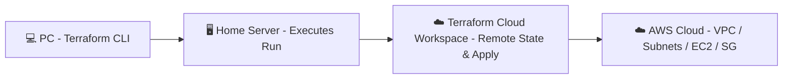

# 🌩️ Terraform Infrastructure as Code (IaC)

Welcome to **Terraform Infrastructure as Code (IaC)** — a modern, modular, and automated approach to deploying and managing AWS infrastructure using Terraform and HashiCorp Cloud.

---

## 🚀 About the Project

This project demonstrates the power of **Infrastructure as Code (IaC)** using **Terraform** to build a complete AWS environment from the ground up.  
It is designed to be modular, reusable, and easily managed through **Terraform Cloud (HC Cloud)**, enabling centralized execution and collaboration.

All infrastructure resources are created using Terraform configuration files stored in version control and executed remotely through a **Terraform Cloud workspace**.  
This setup allows you to initiate and manage deployments from any machine or server without directly running Terraform commands locally on your AWS environment.

---

## 🧱 Infrastructure Components

The following AWS components are provisioned by this project:

- **VPC (Virtual Private Cloud)**  
- **Route Table & Internet Gateway**  
- **Public and Private Subnets** distributed across **three Availability Zones (AZs)**  
- **Security Group** configuration for controlled network access  
- **Five EC2 Instances**, dynamically created using Terraform **modules**  

The EC2 creation uses a **module-based approach** — instead of repeating the same configuration multiple times, a reusable **EC2 module** is defined once and instantiated multiple times with different parameters (such as instance type, subnet, and tags).  
This design ensures **cleaner code**, **scalability**, and **easier maintenance**.

---

## 🧩 Architecture Overview

```
Terraform Cloud (Remote Execution)
│
├── Authenticates via Workspace → HC Cloud Backend
│
└── Provisions Infrastructure on AWS
├── VPC
├── Internet Gateway
├── Route Tables
├── Subnets (AZ1, AZ2, AZ3)
├── Security Groups
└── EC2 Instances (via Module)
```


All execution, state management, and planning are performed remotely in Terraform Cloud, providing:
- **Centralized visibility** of plans and applies  
- **Team collaboration** and controlled access  
- **Automatic state locking** and versioning  
- **Secure secret management** for AWS credentials  

---

## 🧰 Tools & Technologies

| Tool / Service | Purpose |
|-----------------|----------|
| **Terraform** | Infrastructure as Code engine |
| **Terraform Cloud (HC Cloud)** | Remote backend for execution, state management, and workspace collaboration |
| **AWS Cloud Platform** | Target environment for infrastructure deployment |
| **Modules** | Reusable, parameterized Terraform configurations for EC2 and other components |
| **Git / GitHub** | Version control and code repository |

---

## ⚙️ How It Works

1. The project is configured with a **remote backend** pointing to **Terraform Cloud**.
2. A **workspace** (e.g., `aws-infra`) is created in Terraform Cloud.
3. Terraform is executed remotely using the workspace, while AWS credentials are securely stored as environment variables in Terraform Cloud.
4. You can trigger runs directly from:
   - Your **local machine**, or  
   - A **server environment**, or  
   - **Terraform Cloud UI / API**
5. Terraform Cloud handles the execution and applies all changes directly to AWS.

This allows you to manage infrastructure remotely while maintaining control and visibility through the HC Cloud dashboard.

---

## 🧭 Benefits of IaC

Using Terraform Infrastructure as Code gives you:

- **Version-controlled, auditable infrastructure**  
- **Automated provisioning** with no manual steps  
- **Reusable and maintainable code** through modular design  
- **Faster environment replication** (dev, test, prod)  
- **Consistent and predictable infrastructure**  
- **Centralized governance** using Terraform Cloud  

---

## 🧩 Example Project Structure

```
├── main.tf → Root configuration (VPC, subnets, gateways, modules)
├── variables.tf → Input variables
├── outputs.tf → Output values
├── provider.tf → AWS provider and remote backend configuration
├── modules/
│ ├── ec2/ → EC2 module (AMI, instance type, key pair, tags)
│ └── vpc/ → Optional VPC module (if modularized)
└── environments/
├── dev/
├── stage/
└── prod/
```

Each module is parameterized using input variables, allowing easy scaling and configuration changes without code duplication.

---

## ⚙️ Typical Commands

Run these commands locally or via CI/CD — Terraform Cloud will handle remote execution:

```bash
terraform init -reconfigure
terraform validate
terraform plan
terraform apply
terraform destroy

```
## 🖼️ Architecture Diagram



